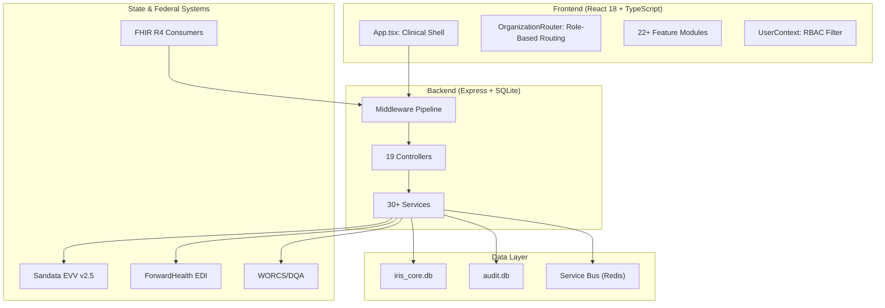
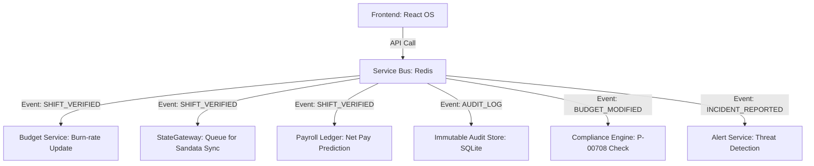
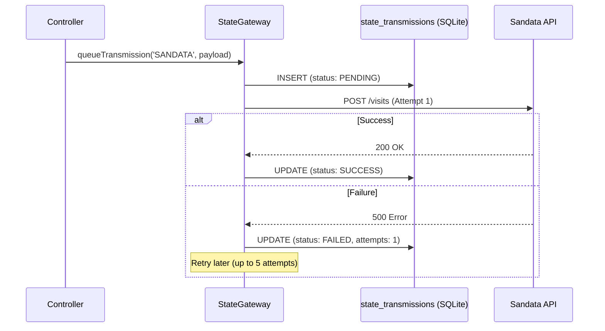
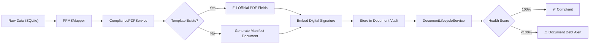
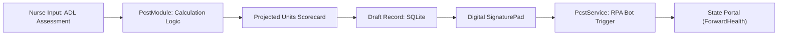
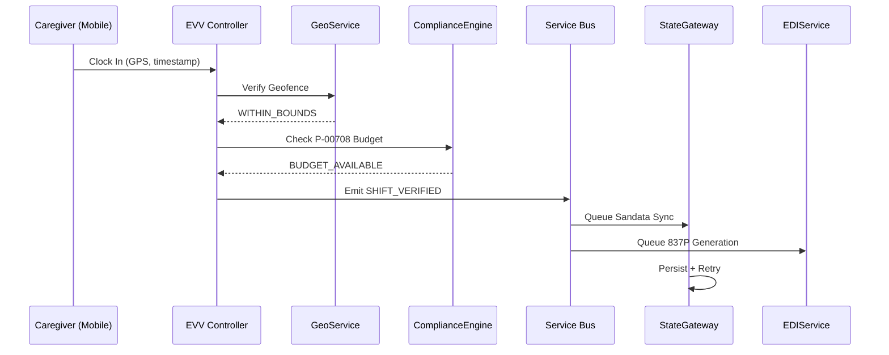

# IRIS Digital OS: Enterprise Architecture Map

This document maps the core components of IRIS OS to the industrial-strength patterns required for large-scale Fiscal Employer Agent (FEA) and ICA operations. It is the technical companion to the README.

---

## 1. System Architecture Overview



---

## 2. The Asynchronous Spine (Service Bus)

IRIS OS uses an **Event-Driven Architecture (EDA)** to decouple user interactions from high-latency background processes.



### Why Redis?
- **Speed:** Sub-millisecond latency for UI event propagation.
- **Persistence:** Event durability ensures no data loss during server restarts.
- **Enterprise Ready:** Same pattern used by AlayaCare, iLIFE, and large-scale EHRs.
- **Graceful Fallback:** If Redis is unavailable, events process synchronously.

---

## 3. State API Persistence Layer (StateGateway)

The StateGateway manages all outbound transmissions to state databases. It solves the critical problem of **transmission debt** — packets that fail to reach state systems due to network issues, API rate limits, or credential expiry.



### Connector Registry

| Connector | Protocol | Auth Method | State System |
|-----------|----------|-------------|-------------|
| **Sandata** | REST API v2.5 | HTTP Basic + Account Header | Wisconsin EVV Aggregator |
| **ForwardHealth** | X12 837P via SFTP | Certificate-based | Medicaid Claims Portal |
| **WORCS** | CSV Batch Upload | Session-based | WI Dept. of Quality Assurance |
| **FHIR R4** | REST (Inbound) | API Key (`X-API-Key`) | External EHR consumers |

---

## 4. Integrated Compliance Layer (HL7 FHIR R4)

IRIS OS standardizes all participant and visit data using the **HL7 FHIR 4.0** (Fast Healthcare Interoperability Resources) model for bidirectional data exchange with legacy EHR systems.

| IRIS Internal Object | FHIR Resource | Key Mappings |
| :--- | :--- | :--- |
| **Participant** | [Patient](https://hl7.org/fhir/R4/patient.html) | `name`, `identifier[MCI]`, `address.state: "WI"` |
| **Caregiver** | [Practitioner](https://hl7.org/fhir/R4/practitioner.html) | `name`, `identifier[WorkerID]`, `qualification` |
| **Visit (EVV)** | [Observation](https://hl7.org/fhir/R4/observation.html) | `effectivePeriod`, `component[GPS]`, `status` |
| **Care Plan (ISSP)** | [CarePlan](https://hl7.org/fhir/R4/careplan.html) | `period`, `activity[ServiceCode]`, `goal` |

### Supported External Systems (Simulated)
- **WellsKy (formerly Kinnser):** Home health and hospice EHR
- **HHAeXchange:** Medicaid-focused home care management
- **PointClickCare:** Long-term care and senior living

---

## 5. Document Lifecycle Architecture

The Document Pipeline handles the complete lifecycle of clinical and employment forms — from data mapping to PDF generation to compliance tracking.



### Expiration Rules (Wisconsin DHS Compliance)
| Form | Renewal Period | Action on Expiry |
|------|---------------|-----------------|
| F-82064 (Background Disclosure) | **4 years** | Block payroll until renewed |
| F-01201A (ISSP) | **1 year** (anniversary date) | Trigger renewal workflow |
| W-2 (Wage Statement) | **Annual** (January) | Auto-generate from payroll data |
| I-9 (Employment Eligibility) | **On hire + reverification** | Flag in Document Debt HUD |

---

## 6. Clinical Assessment Automation

IRIS OS automates the conversion of clinical assessment data (ADLs) into state-mandated service units (PCST).



### PCST Calculation Logic
| ADL Dependency | Range | Unit Impact |
| :--- | :--- | :--- |
| Bathing | 0 - 2 | Score * 10 |
| Dressing | 0 - 2 | Score * 10 |
| Mobility | 0 - 3 | Score * 10 |

---

## 7. Security & Multi-Tenancy Model

### Encryption Flow
```
SSN Input → CryptoService.encrypt() → [IV]:[AuthTag]:[Cipher] → SQLite
SQLite → CryptoService.decrypt() → Plaintext (transient, never cached)
```

### Multi-Tenant Data Isolation
IRIS OS implements **Logical Isolation** at the application layer:
- **Tenant ID Injection:** Every request carries `X-Tenant-Id` header (e.g., `CONNECTIONS_ICA`, `PREMIER_FMS`).
- **Query Scoping:** All database queries are filtered by tenant context.
- **Audit Locking:** Once an event is published to the Service Bus, it is timestamped and written to an immutable log.

### Middleware Pipeline (Request Flow)
```
Request → helmet() → cors() → express.json() → tenantMiddleware → [apiKeyAuth] → Controller → Service → Database
```

---

## 7. Operational Data Flow

### Visit Verification → Billing → State Sync


### Incident → Alert → Escalation
```
Incident Reported → NLP Analysis → Risk Score → AlertService.raiseAlert()
                                                        │
                                    ┌───────────────────┼──────────────────┐
                                    ▼                   ▼                  ▼
                              Admin Dashboard     Email Service      Audit Log
                              (Real-time)        (Notification)     (Immutable)
```

---

## 8. Performance & Scaling Considerations

| Component | Current (Dev) | Production Recommendation |
|-----------|--------------|--------------------------|
| Database | SQLite (embedded) | PostgreSQL + read replicas |
| Cache | In-memory | Redis Cluster |
| File Storage | Local filesystem | AWS S3 with SSE-KMS |
| Hosting | Single Node.js process | Kubernetes (3+ pod minimum) |
| Auth | Mock / API Key | OAuth 2.0 + MyWisconsin ID SSO |
| Monitoring | Console logging | Datadog / CloudWatch |

---

*Last Updated: 2026-04-18 | Confidential - For Internal Engineering Use*
